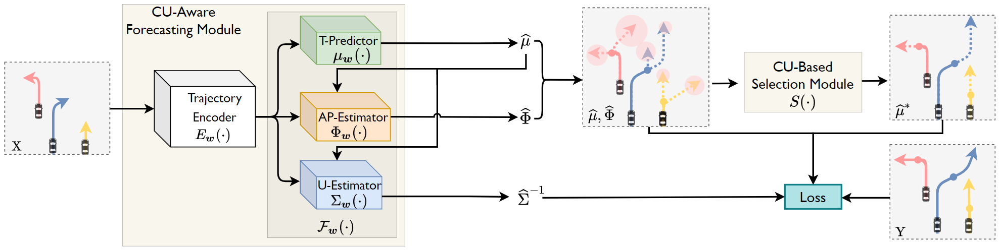
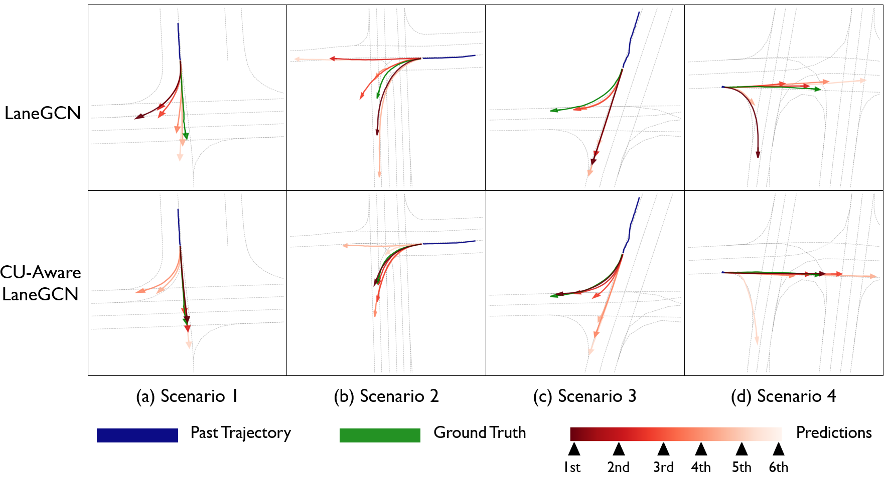

## Collaborative Uncertainty

**Official PyTorch code** for our NeurIPS'21 paper [Collaborative Uncertainty in Multi-Agent Trajectory Forecasting](https://arxiv.org/abs/2110.13947) and the journal version of it [Collaborative Uncertainty Benefits Multi-Agent Multi-Modal Trajectory Forecasting](https://arxiv.org/abs/2207.05195).



**Abstract**: In multi-modal multi-agent trajectory forecasting, two major challenges have not been fully tackled: 1) how to measure the uncertainty brought by the interaction module that causes correlations among the predicted trajectories of multiple agents; 2) how to rank the multiple predictions and select the optimal predicted trajectory. In order to handle aforementioned challenges, this work first proposes a novel concept, collaborative uncertainty (CU), which models the uncertainty resulting from interaction modules. Then we build a general CU-aware regression framework with an original permutation-equivariant uncertainty estimator to do both tasks of regression and uncertainty estimation. Further, we apply the proposed framework to current SOTA multi-agent multi-modal forecasting systems as a plugin module, which enables the SOTA systems to 1) estimate the uncertainty in the multi-agent multi-modal trajectory forecasting task; 2) rank the multiple predictions and select the optimal one based on the estimated uncertainty. We conduct extensive experiments on a synthetic dataset and two public large-scale multi-agent trajectory forecasting benchmarks. Experiments show that: 1) on the synthetic dataset, the CU-aware regression framework allows the model to appropriately approximate the ground-truth Laplace distribution; 2) on the multi-agent trajectory forecasting benchmarks, the CU-aware regression framework steadily helps SOTA systems improve their performances. Specially, the proposed framework helps VectorNet improve by 262 cm regarding the Final Displacement Error of the chosen optimal prediction on the nuScenes dataset; 3) for multi-agent multi-modal trajectory forecasting systems, prediction uncertainty is positively correlated with future stochasticity; and 4) the estimated CU values are highly related to the interactive information among agents. The proposed framework is able to guide the development of more reliable and safer forecasting systems in the future.


We give an example of trajectories predicted by the CU-Aware LaneGCN, LaneGCN and the corresponding ground truth on Argoverse dataset as following:



The blue line is the past trajectory, the green line is the ground truth future trajectory, and the red lines are predictions generated by the models. The color bar indicates the reliability of each prediction: 1st stands for the most reliable prediction, 2nd for the second most reliable prediction, and so on.

## Requirement

### Recommend Environment

* Tested OS: Linux / RTX 3090
* Python == 3.7.11
* PyTorch == 1.8.1+cu111

## Data preparation
You can find the data of Argoverse Dataset from this [link](https://www.argoverse.org/av1.html#download-link).

## Overview

This code is based on the official code of LaneGCN ([Paper](https://arxiv.org/pdf/2007.13732.pdf); [Github](https://github.com/uber-research/LaneGCN)). 

A quick summary of different folders:

- Single Modal contains the source code for the model with proposed collaborative uncertainty framework in single-modal trajectory forecasting.

- Multi Modal contains the source code for the model with proposed collaborative uncertainty framework in multi-modal trajectory forecasting.


## Acknowledgement

We thanks for the Argoverse data and the code provided by LaneGCN ([Paper](https://arxiv.org/pdf/2007.13732.pdf); [Github](https://github.com/uber-research/LaneGCN)).

## Citation

If you use this code, please cite our papers:

```
@InProceedings{tang2021collaborative,
  title={Collaborative Uncertainty in Multi-Agent Trajectory Forecasting}, 
  author={Bohan Tang and Yiqi Zhong and Ulrich Neumann and Gang Wang and Ya Zhang and Siheng Chen},
  booktitle = {NeurIPS},
  year={2021}
}
```

```
@misc{https://doi.org/10.48550/arxiv.2207.05195,
  doi = {10.48550/ARXIV.2207.05195},
  url = {https://arxiv.org/abs/2207.05195},
  author = {Tang, Bohan and Zhong, Yiqi and Xu, Chenxin and Wu, Wei-Tao and Neumann, Ulrich and Wang, Yanfeng and Zhang, Ya and Chen, Siheng},
  keywords = {Computer Vision and Pattern Recognition (cs.CV), Machine Learning (stat.ML), FOS: Computer and information sciences, FOS: Computer and information sciences},
  title = {Collaborative Uncertainty Benefits Multi-Agent Multi-Modal Trajectory Forecasting},
  publisher = {arXiv},
  year = {2022},
  copyright = {arXiv.org perpetual, non-exclusive license}
}
```
